# HTB Sherlock: PhantomCheck

**Category:** DFIR — Windows Event Log Analysis
**Difficulty:** Beginner
**Tools:** Kali Linux, python-evtx (Evtx library), grep, sed

## Scenario

Talion suspects that a threat actor carried out anti-virtualization checks to avoid detection in sandboxed environments. The task was to analyze Windows event logs and identify the specific techniques used for virtualization detection, providing evidence of the registry checks or processes the attacker executed.

## Provided Artifacts

- `Microsoft-Windows-Powershell.evtx` — PowerShell Engine log (script content, EventID 400-series)
- `Windows-Powershell-Operational.evtx` — PowerShell Operational log (script block logging, EventID 4104)

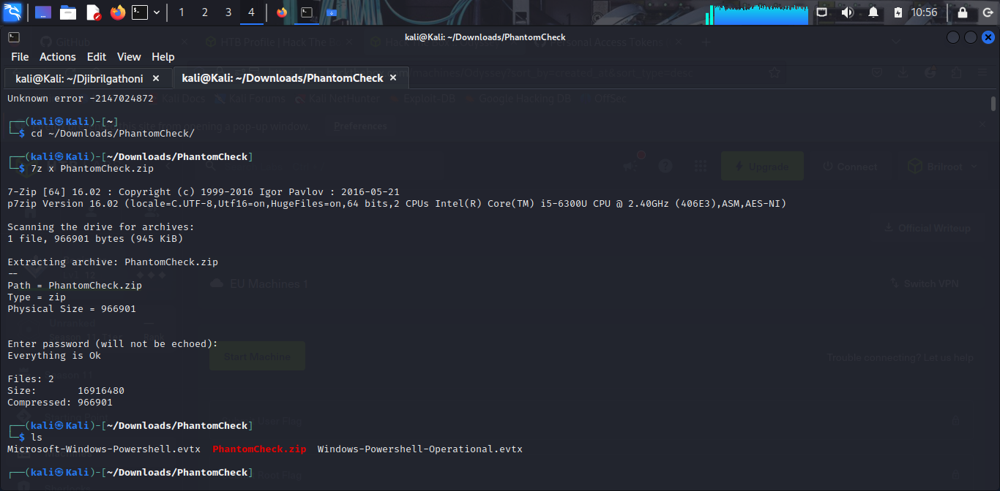

## Setup

Standard `python-evtx` install via pip hit a broken `setuptools`/`jaraco.functools` dependency conflict on Kali's system Python. Solved by isolating in a virtual environment:

```bash
python3 -m venv ~/evtx-venv
source ~/evtx-venv/bin/activate
pip install python-evtx
```

The packaged `evtx_dump` entrypoint script also had a `ModuleNotFoundError: No module named 'scripts'` bug, so the `Evtx` library was called directly instead:

```python
from Evtx.Evtx import Evtx
from Evtx.Views import evtx_file_xml_view
import sys

with Evtx(sys.argv[1]) as log:
    with open(sys.argv[2], 'w') as out:
        for xml, record in evtx_file_xml_view(log.get_file_header()):
            out.write(xml)
```

Both logs were converted to XML for analysis (`psengine.xml`, `psoperational.xml`).

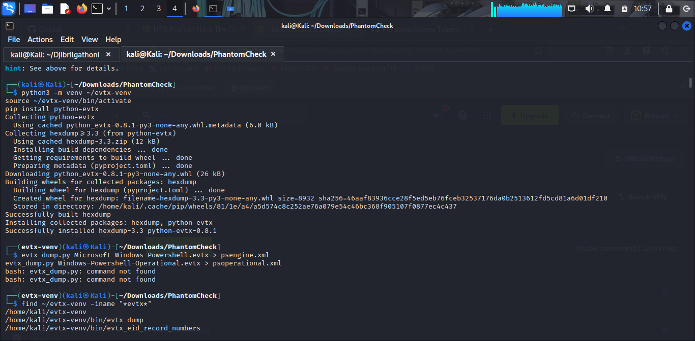

## Investigation

### Task 1 — WMI Class for Model/Manufacturer

**Command:**
```bash
grep -i -E "vbox|vmware|virtualbox|qemu|hyper-v|manufacturer|win32_computersystem" psoperational.xml
```

**Breakdown:**
The attacker's script ran a WMI query against `Win32_ComputerSystem`, pulling both `Manufacturer` and `Model` properties:

```powershell
$Manufacturer = Get-WmiObject -Class Win32_ComputerSystem | select-object -expandproperty "Manufacturer"
$Model = Get-WmiObject -Class Win32_ComputerSystem | select-object -expandproperty "Model"
if((($Manufacturer.ToLower() -eq "microsoft corporation") -and ($Model.ToLower().contains("virtual"))) -or ($Manufacturer.ToLower().contains("vmware")) -or ($Model.ToLower() -eq "virtualbox")) {write-host "Virtualization environment detected!"}
```

**Result:** `Win32_ComputerSystem`

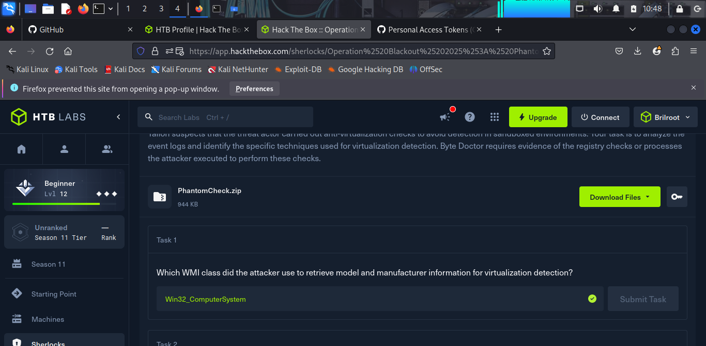
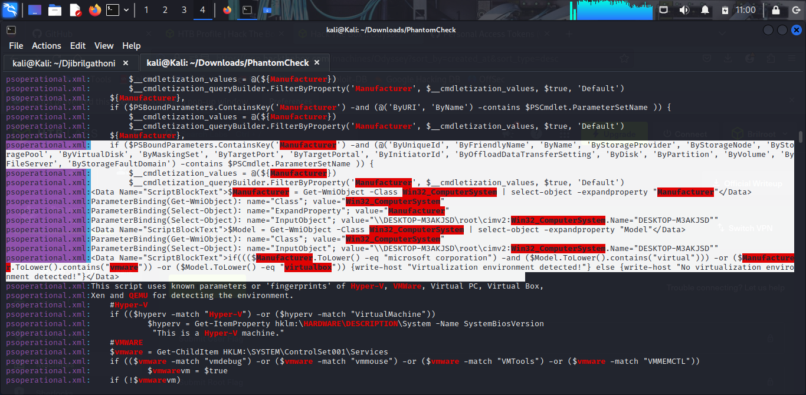

---

### Task 2 — WMI Query for Temperature

**Command:**
```bash
grep -i -E "thermalzone|temperature|MSAcpi" psoperational.xml psengine.xml
```

**Breakdown:**
The script attempted to pull the system's thermal zone temperature — a heuristic based on the fact that hypervisors rarely expose ACPI thermal sensors to guest VMs:

```powershell
Get-WmiObject -Query "SELECT * FROM MSAcpi_ThermalZoneTemperature" -ErrorAction SilentlyContinue
```

The query failed (`Invalid class "MSAcpi_ThermalZoneTemperature"`) because `MSAcpi_ThermalZoneTemperature` lives in the `root\WMI` namespace, but no `-Namespace` parameter was specified, so it defaulted to `root\cimv2`. The `-ErrorAction SilentlyContinue` flag suggests this failure was anticipated.

**Result:** `SELECT * FROM MSAcpi_ThermalZoneTemperature`

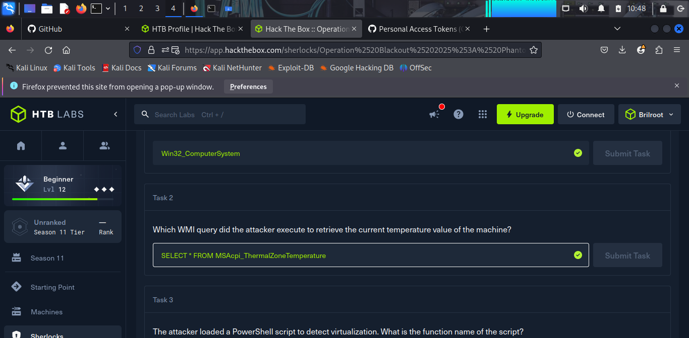
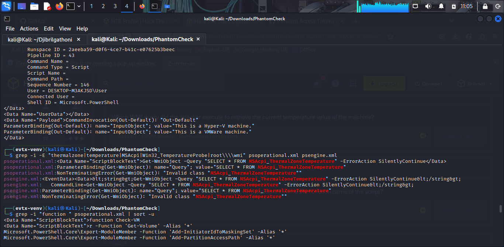

---

### Task 3 — Function Name

**Command:**
```bash
grep -i "function " psoperational.xml | sort -u
```

**Breakdown:**
Buried among PowerShell's built-in storage module function exports, the attacker-defined function stood out:

```powershell
function Check-VM
{
...
```

**Result:** `Check-VM`

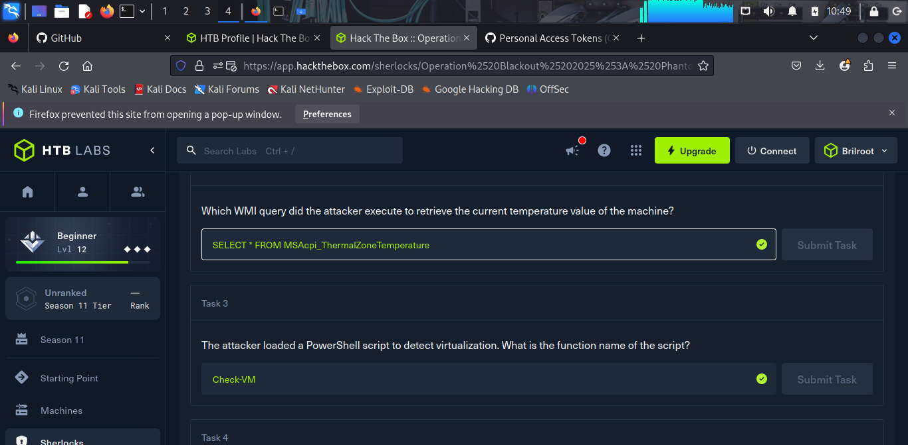
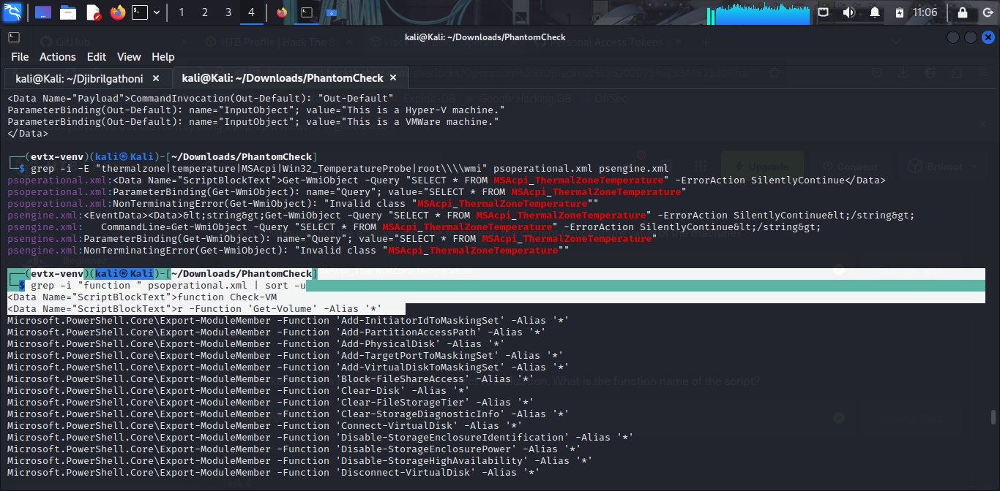

---

### Task 4 — Registry Key for Service Details

**Command:**
```bash
grep -n "Get-ChildItem HKLM" psoperational.xml
```

**Breakdown:**
`Check-VM` enumerated services under a single registry key, then pattern-matched the subkey names against known hypervisor service signatures — VMware (`vmdebug`, `vmmouse`, `VMTools`, `VMMEMCTL`) and Hyper-V (`vmicheartbeat`, `vmicvss`, `vmicshutdown`, `vmiexchange`):

```powershell
$vmware = Get-ChildItem HKLM:\SYSTEM\ControlSet001\Services
if (($vmware -match "vmdebug") -or ($vmware -match "vmmouse") -or ($vmware -match "VMTools") -or ($vmware -match "VMMEMCTL"))
```

**Result:** `HKLM:\SYSTEM\ControlSet001\Services`

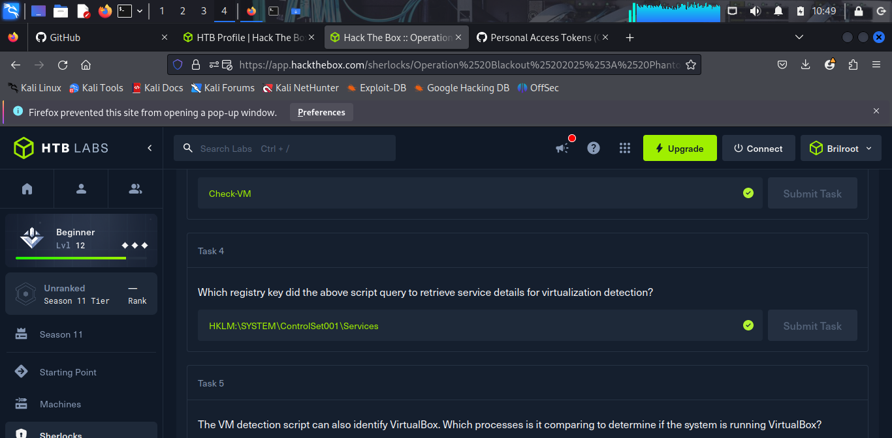
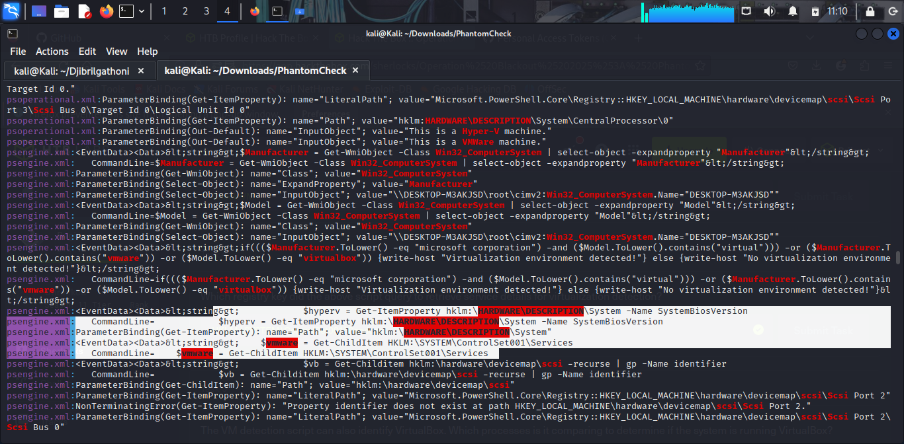

---

### Task 5 — VirtualBox Process Check

**Command:**
```bash
grep -n "vboxservice\|vboxtray" psoperational.xml
```

**Breakdown:**
Running processes were enumerated and compared against the two core VirtualBox Guest Additions processes:

```powershell
$vb = Get-Process
if (($vb -eq "vboxservice.exe") -or ($vb -match "vboxtray.exe"))
```

**Result:** `vboxservice.exe`, `vboxtray.exe`

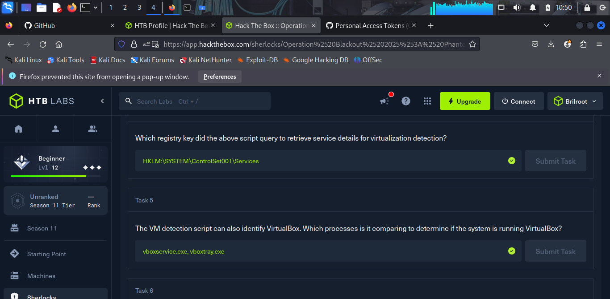
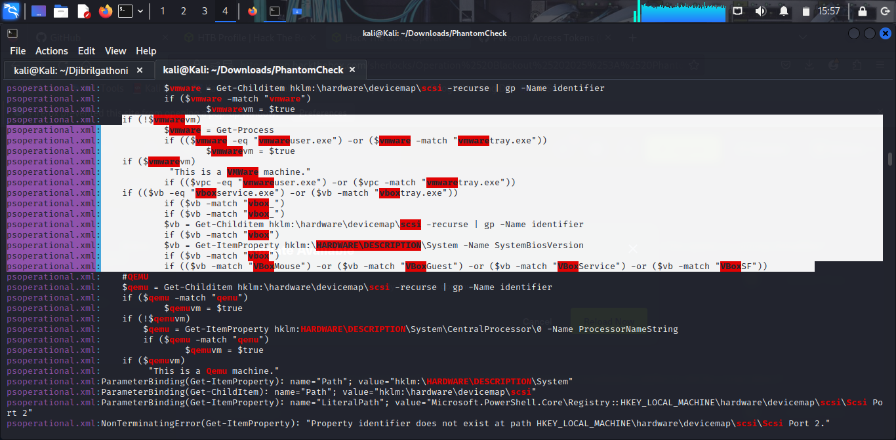

---

### Task 6 — Platforms Detected

**Command:**
```bash
grep "ParameterBinding(Out-Default)" psoperational.xml | grep "This is a"
```

**Breakdown:**
The script's own console output confirmed which hypervisor signatures matched at runtime:

```
ParameterBinding(Out-Default): name="InputObject"; value="This is a Hyper-V machine."
ParameterBinding(Out-Default): name="InputObject"; value="This is a VMWare machine."
```

Both fired within the same script execution (Pipeline ID 43, Sequence Number 146) on host `DESKTOP-M3AKJSD` — indicating a nested virtualization setup, most likely a cloud-hosted analysis sandbox (VMware guest running atop a Hyper-V backed host).

**Result:** Hyper-V, VMware

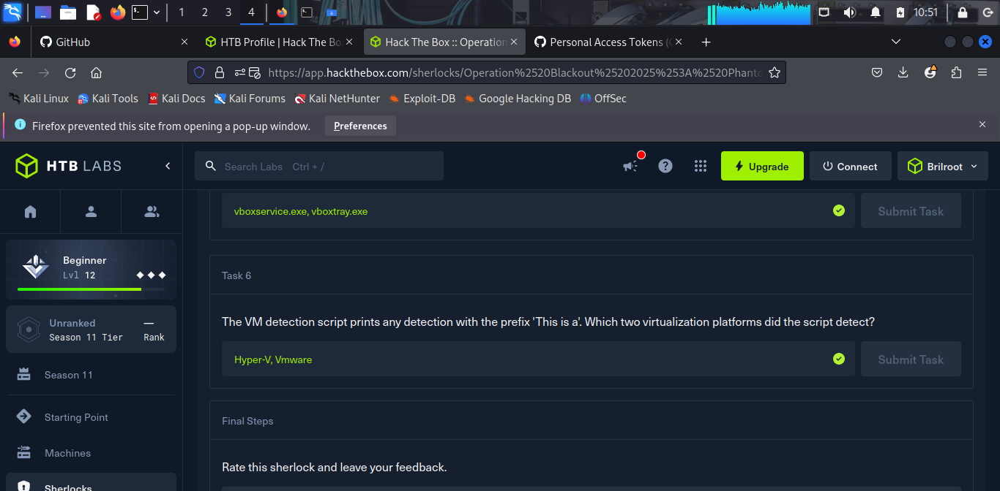
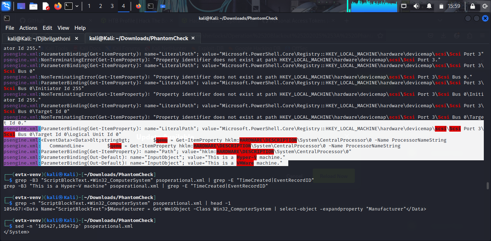

## Attack Chain Summary

1. Attacker executed a PowerShell function named **`Check-VM`** on host `DESKTOP-M3AKJSD`.
2. **Stage 1 (quick triage):** WMI query against `Win32_ComputerSystem` for Manufacturer/Model, checked against known VM vendor strings.
3. **Stage 2 (deep fingerprinting):** Sequential checks for Hyper-V, VMware, VirtualBox, and QEMU via:
   - Registry queries: `HKLM:\HARDWARE\DESCRIPTION\System` (BIOS version), `HKLM:\HARDWARE\DESCRIPTION\System\BIOS` (SystemManufacturer), `HKLM:\SYSTEM\ControlSet001\Services` (service enumeration), `HKLM:\hardware\devicemap\scsi` (recursive SCSI identifier lookup), `HKLM:\HARDWARE\DESCRIPTION\System\CentralProcessor\0` (ProcessorNameString)
   - Process enumeration: `vmwaretray.exe`, `vboxservice.exe`, `vboxtray.exe`
   - WMI thermal zone query (failed due to missing namespace, but attempted anyway)
4. Script confirmed the host as both a **Hyper-V** and **VMware** environment, printed to console via `Out-Default`.

## MITRE ATT&CK Mapping

| Technique | ID | Evidence |
|---|---|---|
| Virtualization/Sandbox Evasion: System Checks | T1497.001 | Registry/BIOS/process fingerprinting across four hypervisors |
| Query Registry | T1012 | `HKLM:\HARDWARE\DESCRIPTION\System`, `\BIOS`, `\devicemap\scsi`, `\SYSTEM\ControlSet001\Services` |
| Process Discovery | T1057 | Enumeration for `vboxservice.exe`, `vboxtray.exe`, `vmwaretray.exe` |
| System Information Discovery | T1082 | WMI queries for `Win32_ComputerSystem`, thermal zone data |

## Lessons Learned

Anti-VM detection doesn't require exotic tooling, a well-informed checklist of registry paths, running processes, and hardware artifacts (like thermal sensors) is enough to reliably fingerprint a sandbox. PowerShell Script Block Logging (Event ID 4104) proved essential here, since it captured the full deobfuscated script content rather than just command-line summaries — without it, this entire detection routine would have been invisible in standard logs.

